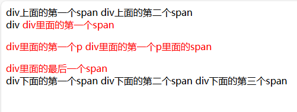
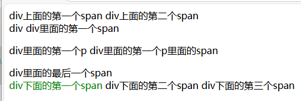
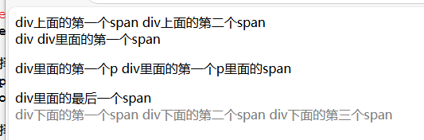
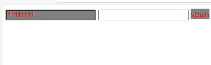
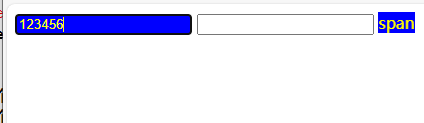
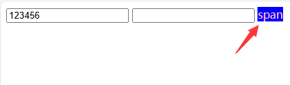
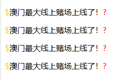

前端
	CSS 2d
	
	
## 什么是CSS?
	css就是用来调节标签样式的
	层叠样式表

## css的注释

```css
	/*单行注释*/
	/*
	多行注释
	多行注释
	*/
	
	因为前端没有严谨的逻辑所以每个样式最好是把注释写清楚，样式功能的开始，样式功能的结尾
	/*这是博客园首页的样式表*/
	
	/*顶部导航条样式开始*/
	
	/*顶部导航条样式结束*/
```

## 1、css的语法结构
	选择器 {属性1:值;属性2:值;属性3:值}

## 2、css的三种引入方式
	1.文件导入式(也是最规范的形式)
	2.head内利用style标签 内部直接书写css代码
	3.行内式(最不推荐使用的)

## 3、css的流程
	1.如何查找标签
	
	2.如何设置样式

## 4、如何查找标签

### 1.基本选择器

#### 标签选择器

```css
标签 {
	属性: 值;
}
```

#### 类选择器

```css

.类名 {
	属性: 值;
}
```

#### id选择器

```css

#id {
	属性: 值;
}

```

#### 通用选择器

```css
* {
	属性: 值;
}
```

### 2.组合选择器

```html
<head>
    <meta charset="UTF-8">
    <title>组合选择器</title>
  <style>
    /*后代选择器 影响第一个标签下的所有子标签*/
    div span {
      color: red;
    }
  </style>
</head>
<body>
<span>div上面的第一个span</span>
<span>div上面的第二个span</span>
<div>div
  <span>div里面的第一个span</span>
  <span>
    <p>div里面的第一个p
      <span>div里面的第一个p里面的span</span>
    </p>
  </span>
  <span>div里面的最后一个span</span>
</div>
<span>div下面的第一个span</span>
<span>div下面的第二个span</span>
<span>div下面的第三个span</span>
</body>
```
样式效果



#### 儿子选择器

```css
    /*效果和上面的后代选择器效果一样*/
    div>span {
      color: blue;
    }

```
#### 邻居选择器

```css
    div+span {
      color: green;
    }

```
效果图



#### 弟弟选择器

```css
    /*弟弟选择器 同级别的下面所有的标签*/
    div~span {
      color: gray;
    }
```
效果图



#### 属性选择器

```html
  <style>
    /*
        1.具有某个属性名
        2.具有某个属性名及属性值
        3.具有某个属性名及属性值某个标签
        */
  /*  只要有hobby属性的标签*/
    [hobby] {
      color: red;
      background: gray;
    }
  </style>
</head>
<body>
<input type="text" name="username" hobby="jbd">
<input type="text">
<span hobby="jbd">span</span>

```


```css
    /*2.具有某个属性名及属性值*/
    [hobby="jbd"] {
        color: yellow;
        background: blue;
    }
```



```css
/*3.具有某个属性名及属性值某个标签*/
        span[hobby="jbd"] {
        color: pink;
        background: blue;
    }

```


### 分组和嵌套

分组：比如三个不同的标签使用的风格都是一样的我们可以使用分组的方式把标签都写在一起
```css
div, span, p {
	color: white;
	background: black;
}
```

嵌套：同事引用id、类、标签选择器，来设置样式。

```css
#d1, .id1, p {
	color: red;
	background: yellow;
}
```


### 3.伪元素选择器

```html
    <style>
        p:before {
            content: "$";
            color: gold;
        }

/*after在解决浮动的问题上 很有用*/
        p:after {
            content: "?";
            color: red;
        }
    </style>
```



### 4.伪类选择器 

```css
    <style>
        /*连接态*/
        a:link {
            color: black;
        }
        /*鼠标悬停*/
        a:hover {
            color: yellow;
        }
        /*鼠标点击*/
        a:active {
            color: green;
        }
        鼠标访问之后
        a:visited {
            color: gray;
        }
        /*    input框被点击的状态 称之为获取焦点*/
        input:focus {
            background: orange;
        }

        input:hover {
            background: red;
        }
    </style>
```


一个标签都应该有的属性

- id  唯一标识 
- ss  类属性
	
	
	
	
	
	