## 今日内容

```text
JavaScript(JS)  前端编程语言
	
JS跟Java没有半毛钱关系，纯粹是为了蹭当时红极一时java的热度

引入js的两种方式
	script  标签内直接写
	script  src属性导入外部文件

js注释
	单行注释   //
	多行注释   /**/
	
js语言是以分号(;)作为语句的结束符
	一般情况下不加分号也不会报错

1.变量
	在js中声明变量需要使用关键字声明
	var  name = 'jason'
	ECMA6最新语法
	let  name = 'jason'
	var与let的区别
		var作用的是全局
		let作业的是局部，可以保证变量的不被随意的修改
	
	在js中 是有真正意义上的常量
	声明常量关键字
	const  pi = 3.1415926
	
	null 表示变量已经声明并且赋值为none
	undifine 表示已经声名变量但是没有赋值
	
	
	js中变量的命名
		数字 字母 下划线 $
		数字不能开头，关键字不能作为变量名
		
	变量的命名规范
		js中推荐你使用驼峰式命名
			userName
			dataOfDb
			ageOfJason
		python中推荐使用下划线
			age_of_jason

	

2.数据类型
	数值类型(整型和浮点型)
		js中将整型和浮点型统称为数值类型
		
		
		NaN：是数值类型但是表示的意思是不是一个数字
		
		
	字符类型(字符串)
		js中字符串的拼接推荐你使用加号(python不推荐使用加号因为效率极低)
		typeof()  查看数据类型，引号可以使用单引号和双引号
		
		定义多行文本` `
		替换变量，和shell使用差不多 ${}引用变量。
		
		字符串的常用方法。
		字符串方法不支持去掉指定的字符串。
		
		js中的字符串拼接推荐使用 +
		
		切片推荐使用slice
		
		转义字符 \
			
	undefined
	对象
		null
		数组 [] 类似python的列表，取值方式是一样的。 
		自定义对象 {}
	布尔值
		js中的布尔值都是全小写
			true
			false 
		布尔值为flase的有
			""(空字符串)、0、null、undefined、NaN
	Symbol
	
3.比较运算符
	== 弱等于 相同数值的字符型和数值型可以返回true
	===  强等于
	
	
4.流程控制
	
	三元表达式
	5>4?a:999 条件成立就是a,不成立就是 999
	
5.函数
	1.普通函数，不带关键字。
	2.带参数函数。
	3.函数没有返回值，默认返回undefined，有多个返回值的时候默认返回最后一个值，可以返回数组[]。
	4.立即执行函数。
	
	
6.内置对象
	object ->  字典
	date对象
	json对象 
	正则对象 正则表达式中不要出现空格，lastindex属性
	math对象

```

## javascript

javascript放在body标签的最下面，在js中有获取标签的操作，只有在整个页面渲染完成之后再去获取标签才能够正常的获取到。

## 1.变量

```text
var x = 1;
undefined
x
1

let y =2
undefined
y
2

const pi=3.14159256
undefined
pi
3.14159256

命名规范建议使用驼峰式命名方式。
```

## 数据类型
```text
引用变量
var name = 'sheldong'
undefined

console.log(`my name is ${name}`)
VM203:1 my name is sheldong

字符串拼接
var a = '666';
undefined
var b = '777'
undefined
a + b
'666777'

# 字符串常用方法
var s1 = 'sheldon'
undefined
s1.substring(0,3)
'she'

s1.slice(0,-1) 这种方法支持到倒数的方式获取
'sheldo'

# 转换大小写
s1.toLowerCase()
'sheldon'
s1.toUpperCase()
'SHELDON'

# 分割字符串
s2 = 'a|vv|df'
'a|vv|df'
s2.split('|')
(3) ['a', 'vv', 'df']
```

## 数组

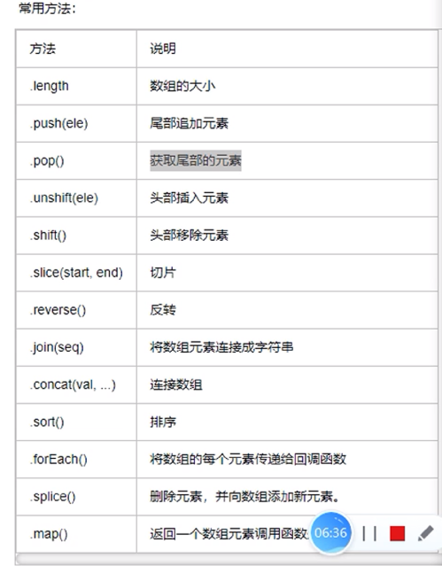
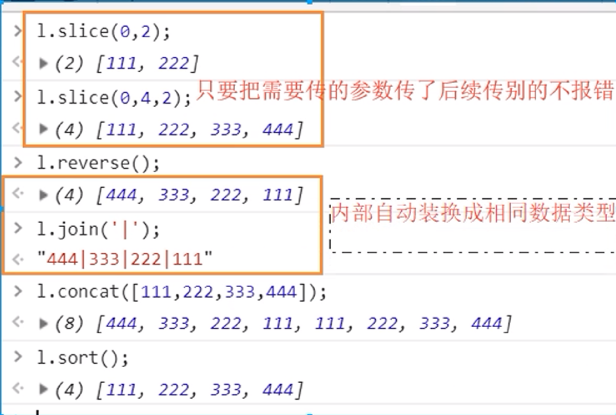
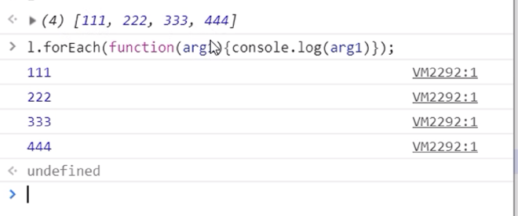
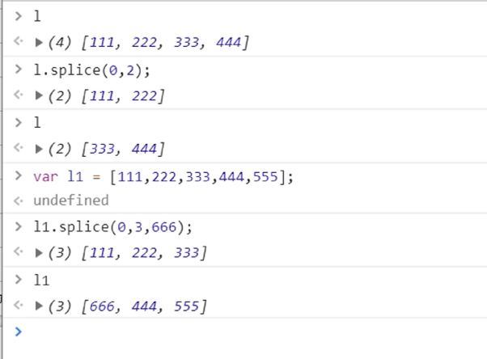


```text

# 切割数组
l1
(8) [11, 22, 33, 55, 66, 43, 88, 23]
l1.slice(0,2)
(2) [11, 22]

# 反转数组
l1
(8) [11, 22, 33, 55, 66, 43, 88, 23]
l1.reverse()
(8) [23, 88, 43, 66, 55, 33, 22, 11]

# 分割数组
l1
(8) [23, 88, 43, 66, 55, 33, 22, 11]
l1.join('|')
'23|88|43|66|55|33|22|11'

# 扩展数组
l1
(8) [23, 88, 43, 66, 55, 33, 22, 11]

l1.concat([1,2,3,4])
(12) [23, 88, 43, 66, 55, 33, 22, 11, 1, 2, 3, 4]

# 数组排序
l1.sort()
(8) [11, 22, 23, 33, 43, 55, 66, 88]

# 通过函数操作数组的每个元素
l1
(8) [11, 22, 23, 33, 43, 55, 66, 88]

VM506:1 Uncaught SyntaxError: Unexpected token ')'Understand this errorAI
l1.forEach(function (args1) {
    console.log(args1)
})
VM596:2 11
VM596:2 22
VM596:2 23
VM596:2 33
VM596:2 43
VM596:2 55
VM596:2 66
VM596:2 88
undefined

# 删除元素
l1
(8) [11, 22, 23, 33, 43, 55, 66, 88]
l1.splice(0,2)
(2) [11, 22]
l1
(6) [23, 33, 43, 55, 66, 88]
```

##  自定义对象

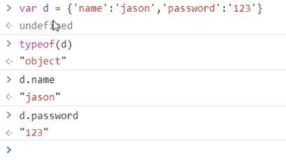

新建对象的第二种方法
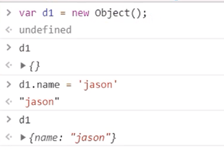

```text
var d = {'name': 'sheldon','password': '12346'}
undefined

typeof(d)
'object'

d.name
'sheldon'

d.password
'12346'
```

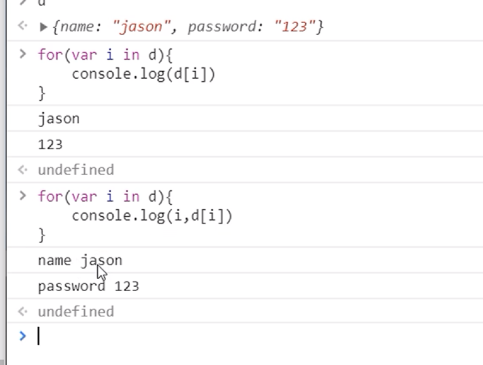

```js
d
{name: 'sheldon', age: 23}

for (let index in d) {console.log(index, d[index])}
VM1980:1 name sheldon
VM1980:1 age 23

```

## 比较运算符

```text
	== 弱等于 相同数值的字符型和数值型可以返回true
	===  强等于

两种方式的不同支出在于，强等于不支持不同类型的变量比较。
'123' === 123
false
'123' == 123
true
```

## 流程控制

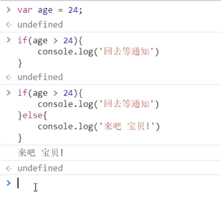

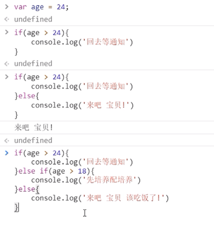

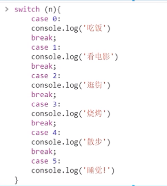

```text
var age = 18;
undefined
if (age < 18) {
    console.log('你还没有成年！')
}

undefined
if (age < 18) {
    console.log('你还没有成年！')
} else {console.log('你已经成年了！')}
VM1166:3 你已经成年了！


var age = 26
if (age < 18) {
    console.log('你还没有成年！')
} else if (age == 26) {
    console.log('年龄刚好')
} else {
    console.log('老baby!')
}

# switch case语句
var n = 3;
undefined
switch (n) {
    case 0:
    console.log('吃饭')
    break;
    case 1:
    console.log('看电影')
    break;
        case 2:
    console.log('碎觉')
    break;
        case 3:
    console.log('yuep')
    break;
}
VM2156:12 yuep

```

## 三元表达式

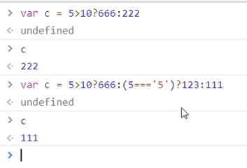

```js
var c = 10 > 5?111:222 /*成立就是:前面的内容*/
undefined
c
111

var c = 100 > 200?111:222 /*成立就是:后面的内容*/
undefined
c
222
```

## 循环

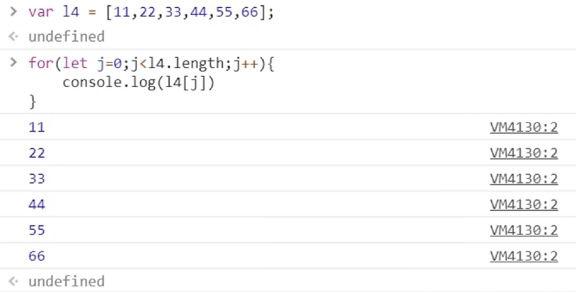
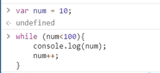

```text
l1
(6) [23, 33, 43, 55, 66, 88]
l1.length
6
for (let index = 0; index < l1.length; index++) {
    console.log(l1[index])
}
VM2386:2 23
VM2386:2 33
VM2386:2 43
VM2386:2 55
VM2386:2 66
VM2386:2 88

var i = 0
undefined
while (i < 10) {
    console.log(i);
    i++;
}
VM2588:2 0
VM2588:2 1
VM2588:2 2
VM2588:2 3
VM2588:2 4
VM2588:2 5
VM2588:2 6
VM2588:2 7
VM2588:2 8
VM2588:2 9
9
```

## 函数

1. 普通函数，不带关键字。
2. 带参数函数。
3. 函数没有返回值，默认返回undefined，有多个返回值的时候默认返回最后一个值，可以返回数组[]。
4. 立即执行函数。

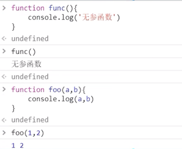
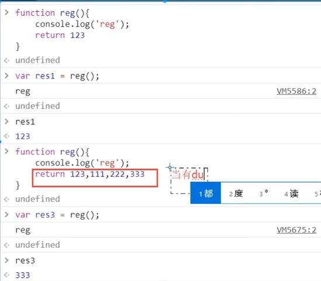


```text
# 没有参数
function func() {
    console.log('没有参数')
}
undefined
func()
VM2757:2 没有参数

# 包含参数
function func1(a,b) {
        console.log(a,b);
}
undefined
func1(1,2)
VM2846:2 1 2

# 返回值，当有多个返回值的时候需要是一个数组，不然就只会返回最后的那一个
function func1(a,b) {
        console.log(a,b);
    let c;
    c = a + b;
    return c;
}
undefined

func1(1,2)
VM2958:2 1 2
3

# 返回值
function func2() {
    return 1,2,3,4
}

func2()
4

# 多个个返回值
function func2() {
    return [1,2,3,4];
}
undefined
func2()
(4) [1, 2, 3, 4]
```

## 内置对象

object ->  字典

```text
var d = {'name': 'sheldon', 'age': 23}
undefined
typeof(d)
'object'

d.name
'sheldon'
d['name']
'sheldon'
```

date对象


```text
var ddd = new Date()

ddd.getFullYear()
2025
ddd.getMonth()
2

ddd.getDate()
16

ddd.getHours()
12

ddd.getMinutes()
25

ddd.getDay()  # 周日
0
```

json对象

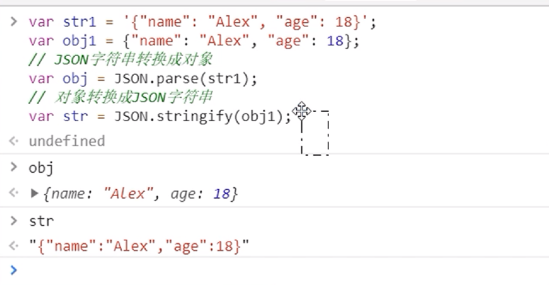

```text
var str1 = '{"name": "sheldon", "age": 23}';
var json1 = '{"name": "sheldon", "age": 23}';

var str1 = '{"name": "sheldon", "age": 23}';
var json1 = '{"name": "sheldon", "age": 23}';
undefined

var obj = JSON.parse(str1)
undefined
obj
{name: 'sheldon', age: 23}
var str = JSON.stringify(json)
undefined
str
'"{\\"name\\": \\"sheldon\\", \\"age\\": 23}"'

```

正则对象 正则表达式中不要出现空格，lastindex属性

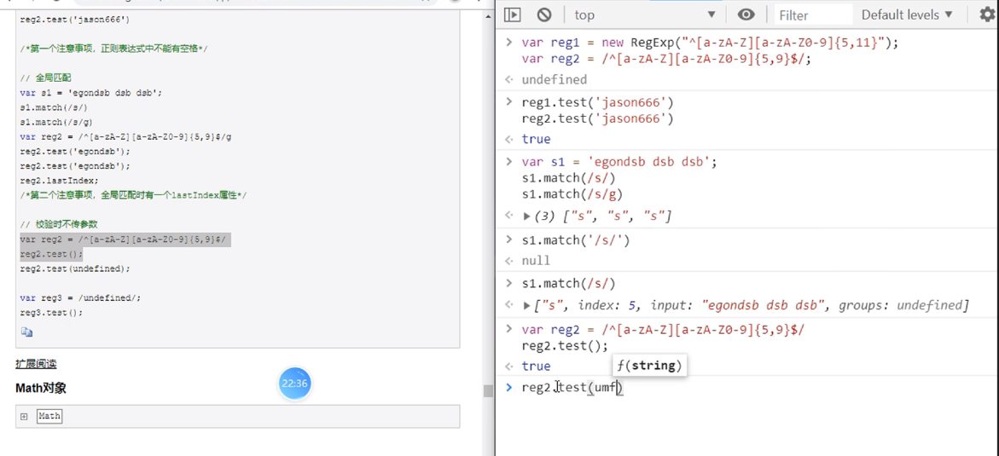
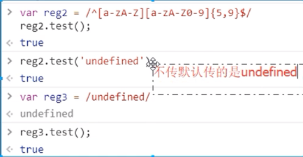

math对象

数学运算，不中重点掌握。

