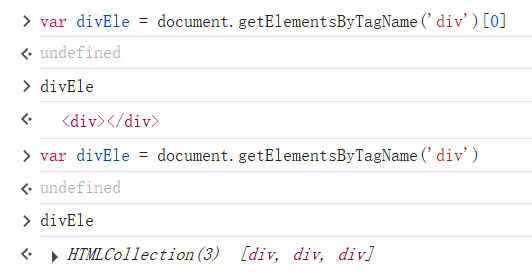

1.BOM操作  DOM操作(******)
	
    BOM 操作
    window.innerHeight 获取浏览器内部高度
    window.innerWidth  获取 浏览器内部宽度
    window.open()  打开新窗口
    window.close()  # 关闭当前窗口

    window.open('https://nginx.org','','width=800px,height=400px,left=200px,top=200px');

    
    window.history.back()  后退
    window.history.forward() 前进
    
    location 打开的网页对象
    location.herf 获取当前网页的地址，如果赋值就会在当前窗口，直接跳转
    location.reload()  重新加载页面

    location
    Location {ancestorOrigins: DOMStringList, href: 'https://github.com/Gshelldong/LearnFront', origin: 'https://github.com', protocol: 'https:', host: 'github.com', …}

    弹出框
    alert('123') 警告框
    confirm('are shure') 询问框 true false
    prompt('请在下方输入')
    
    计时相关
    设置指定时间之后执行某个动作
    setTimeout(func,3000)    3s之后执行函数
    clearTimeout()           清除时间操作
    setInterval()            指定时间执行一次，循环定时器
    clearInteral()           清除定时器
    
DOM操作

    1.查找标签
    当你在查找标签的时候 如果需要给查找出来的标签起一个名字
    那么推荐写法
    var pEle = document.getElementsByClassName('c1')[0]
    通过标签名找，返回数组
    通过class名找,返回数组
    通过id查找,直接拿到标签本身
    

    间接查找
    parentElement 当前便签的父标签
    children 子标签
    firstElementChild 第一个子标签
    lastElementChild  最后一个子标签
    nextElementsibling 下一个兄弟标签
    previousElementsibling 上一个兄弟标签
    

    2.操作标签
    节点操作
    1.js动态创建标签并添加到正常文档流中
    
    document.createElement('img')

    setAttribute 给标签设置其他属性，既可以设置默认属性，也可以设置其他的属性。
    innerText  给标签内部设置文本，可以获取文本。
    innerHTML  可以获取标签内部的HTML，如果为空可以清理标签内部的文本。
    
    js插入新的标签先找到要插入的标签，再调用方法加入设置好的标签。临时创建，不会修改源代码！
    appendChild  标签最后添加子标签
    insertBefore 在一个标签的前面插入新的标签
    

    获取值操作
    .value  获取input输入框的值

类属性操作

    .classList   获取标签所有的类名
    .remove    移除标签的类名
    .add       添加标签的类名
    .contains  判断某个标签是否有类属性
    .toggle    有就删除没有就添加，开关灯。

    js操作样式
    标签.style.front  替换front样式字段，设置相应的值
			
			事件
				符合某个条件下自动触发的动作
				
				绑定事件的两种方式
					1.指名道姓 
					2.js代码绑定(推荐)
					
				
				onload等待对象数据加载完毕
				
			
			js相关的代码通常都会放在body内的最下方
			引入外部js代码的文件 也可以考虑放在body内最下方
			
		绑定事件
			1.获取焦点 onfocus()
			2.取消焦点 onblur()
			3.鼠标点击 onclick()
			4.change  改变事件，输入框内容改变的时候触发事件
				
				
		
	项目需求
		在页面上input框中动态展示当前时间
		
	
	
	jQuery就类似于python的模块,帮你封装了一对复杂的操作暴露给你一些简易的接口
	前端的模块 叫 "类库"
	
	
	
	jQuery的基本语法结构
		$(选择器).action(属性)
	
	jQuery给你简化成了$
	jQuery()  ===  $()
	
	$('p').css('color','blue')
	
	
	基本选择器
		标签
		类
		id
	
	jQuery对象
	原生js对象

	
	2.jQuery  封装了对原生js的操作  类似于你的orm
	
	筛选器
	
	:first 获取第一个标签
	:laset 第二个标签
	:eq(2) 值是2的标签
	:even  偶数索引
	:odd 奇数
	:not 不是指定标签的
	:has 内部有指定元素的标签
	
	模态框示列 百度登录类似
	
	
	属性选择器