## 表单筛选器
筛选器简写
```text
$(':text')
$(':password')
$('input[type="password"]')
$('input[type="text"]')

# 选择框选中默认的筛选器,会把selectd一起选中
$('input:checked')
$(':selected')
$(':disabled')

```
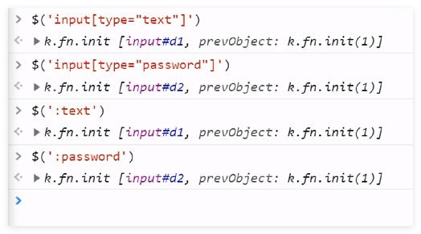
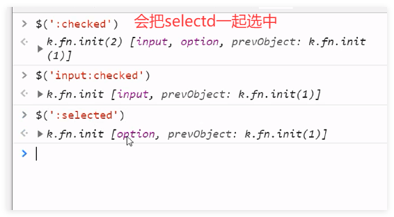
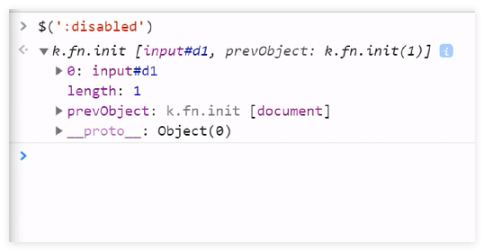

## 筛选器方法

示例代码

```html
<span>span1</span>
<span>span2</span>
<div id="d1">div
    <span>div>span</span>
    <p class="c1">div>p
        <span class="c2">div>p>span</span>
    </p>
    <span id="d2">div>span</span>
</div>
<span>span1</span>
<span>span2</span>
<span id="d3"></span>
```


向下选择
```text
$('#d1').next() # 选择当前标签的下一个标签
$('#d1').nextAall()
$('#d1').nextUntil("#d3")

```
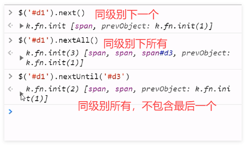

向上选择
```text
$('#d1').prev()

$('#d1').prevAll()

# 上面所有标签不包含最后一个span
$('#d1').prevUntil('span')

```
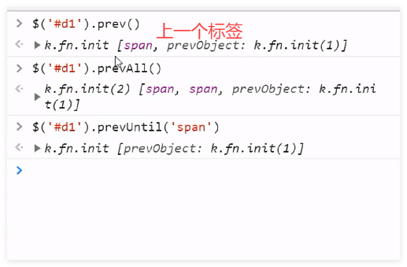

链式选择，可以拿到标签之后再继续调用标签的方法。
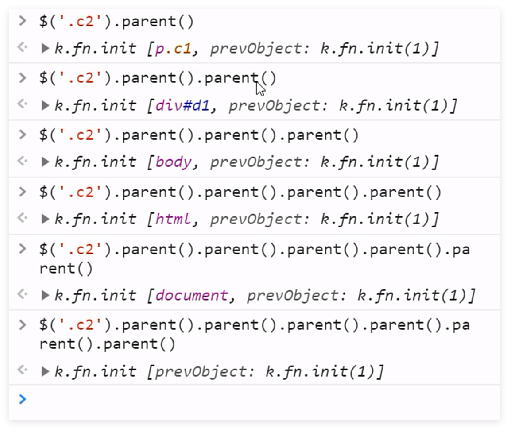

```text
# 所有的父标签
$('.c1').parents()

# 所有的父标签，不包含html标签
$('.c1').parentsUntil('html')

```
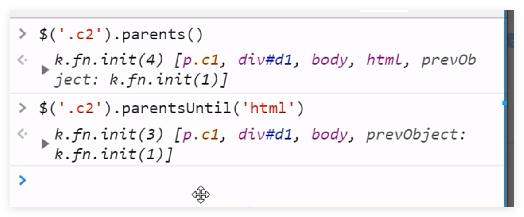

找子标签

```text
# 找子标签,只会找到这个标签的下一级
$('#d1').children()

# 可以找包含在内的所有标签
$('#d1').find('.c2')
```
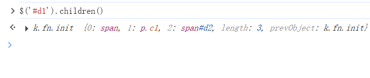
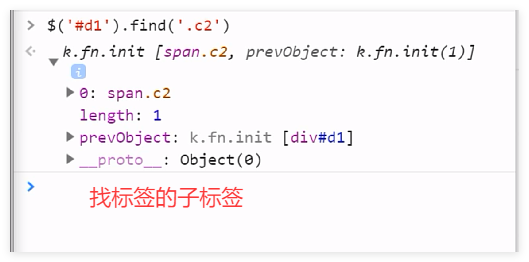

## 同级别所有标签

```jquery
// 同一级别相同的标签
$('#d3').siblings()

```
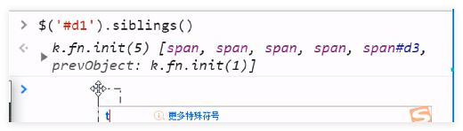

```jquery
// 获取列表元素

$('ul li').first()
```
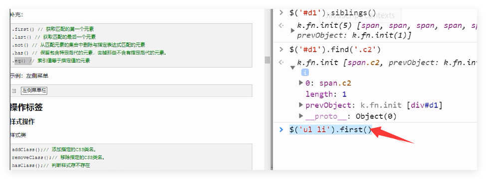


## 样式操作

```html
<div>
  <p>111</p>
  <p>222</p>
</div>
```

```jquery
# 一行控制两个元素样式
$('div').children().first().css('color','red').next().css('color','green')
```
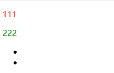

获取标签位置

```text
$('p').position()

$('p').offset()

```
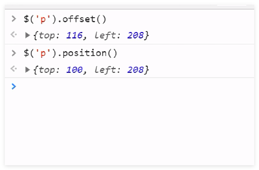

滚动条到顶部的距离

```jquery
$(window).scrollTop()
```
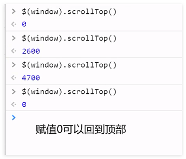


获取元素的宽高

```text
$('p').height()
$('p').width()
$('p').innerWidth()
$('p').innerHeight()
$('p').outerWith()

```
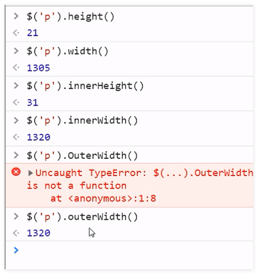

获取input的值
```text
var inputEle = document.getElementsByTagName('input')[0]
undefined
inputEle
<input type=​"text">​
inputEle.value
'123465'

$('input').val()
```
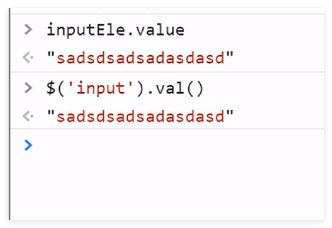

获取标签中的内容
```text
# 设定值可以修改里面的标签里面的内容
$('div').text()
$('div').html("<h1>哈哈哈</h1>")
```
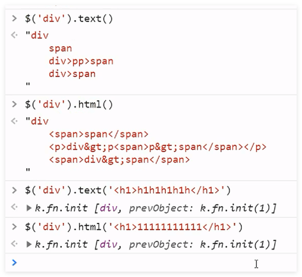

设置属性

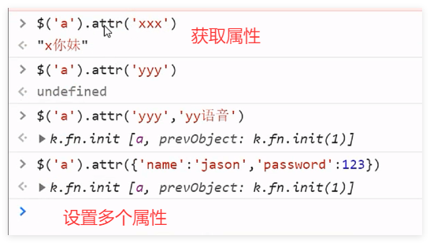

判断选择框是否被选中
```text
# 返回布尔值
$('#d1').prop('checked');
$('#d2').prop('selected');
```
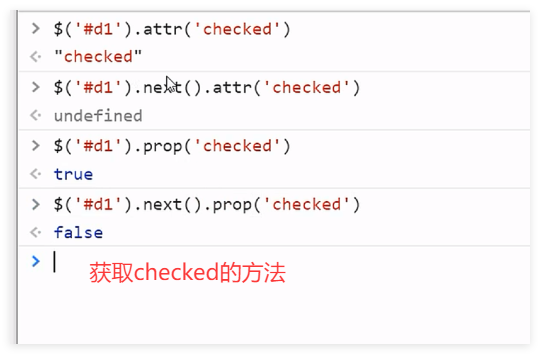
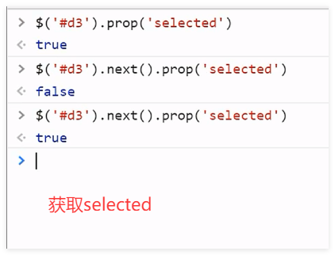

添加标签

```text
# 添加元素
var aEle = document.createElement('a');
aEle.innerText = '点我吧';
aEle.href = 'https://www.baidu.com';
$('.c1').append(aEle);

$(aEle).appendTo($('.c1'))

prepend() - 在被选元素的开头插入内容

remove() - 删除被选元素（及其子元素）
empty() - 从被选元素中删除子元素

$(A).after(B)            A之后放B
$(A).insertAfter(B)      把A放到B后面

$(A).before(B)    A之前放入B
$(A).insertBefore(B)  把A放到B的前面

```
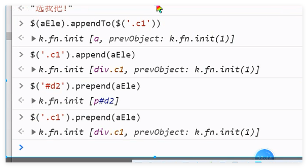
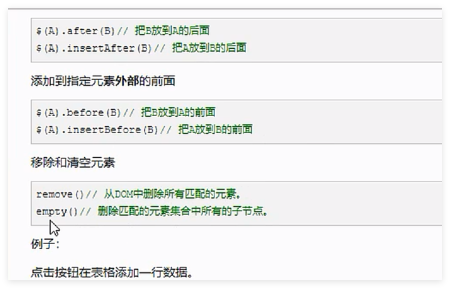

## 动画效果

```text
$('div').hide(5000)   5s后隐藏
$('div').show(5000)   5s后展示
$('div').fadeOut(5000)  5s后淡出
$('div').fadeIn(5000)   5s后淡入
$('div').fadeTo(5000,0.5)  5s逐渐变为0.5透明度
$('div').slideUp(3000)  3s时间向上拉
$('div').slideDown(3000) 3s时间向下放

```

each循环
```text
// 打索引和标签对象
$.each($('div'),function (index,obj) {
    console.log(index,obj)
})

$('div').each(function(index){
    console.log($(this))
})
```
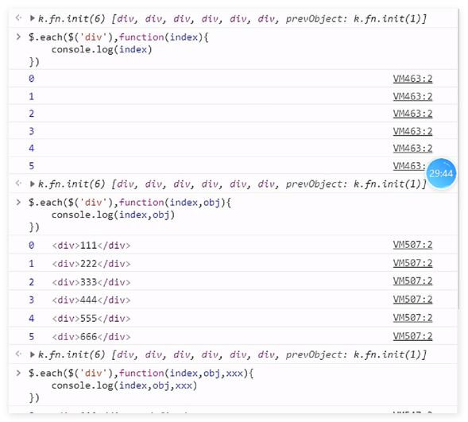
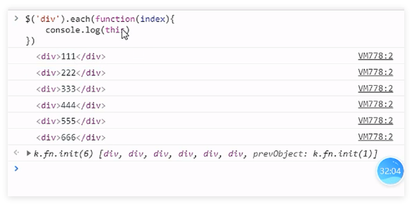

data函数

把标签当作仓库临时放一个键值对数据，不会在文档中显示，但是数据实际是存在的。
