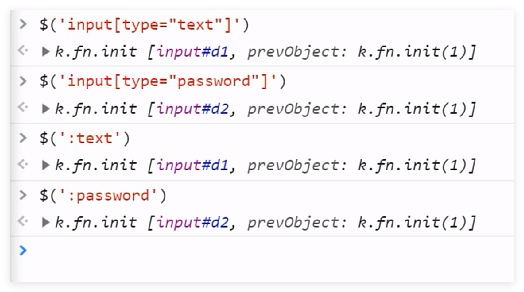
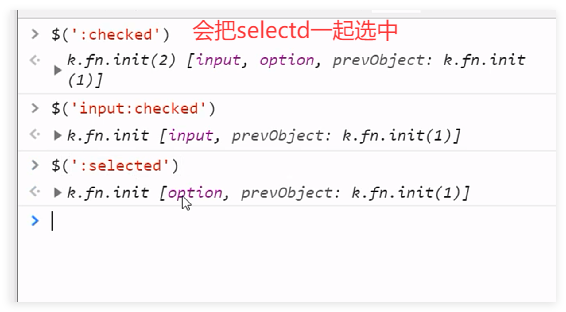
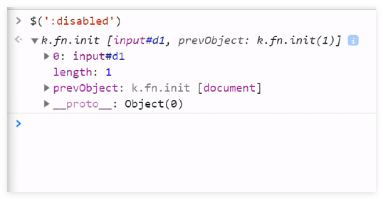
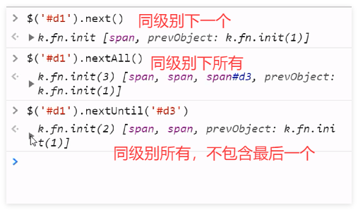
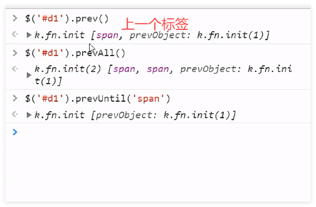
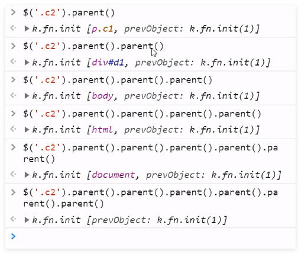
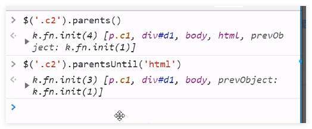
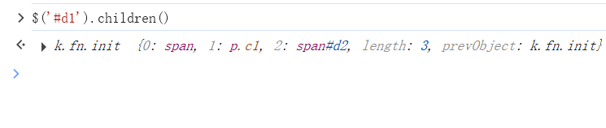
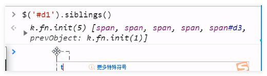

## 表单筛选器
筛选器简写
```text
$(':text')
$(':password')
$('input[type="password"]')
$('input[type="text"]')

# 选择框选中默认的筛选器,会把selectd一起选中
$('input:checked')
$(':selected')
$(':disabled')

```




## 筛选器方法

示例代码

```html
<span>span1</span>
<span>span2</span>
<div id="d1">div
    <span>div>span</span>
    <p class="c1">div>p
        <span class="c2">div>p>span</span>
    </p>
    <span id="d2">div>span</span>
</div>
<span>span1</span>
<span>span2</span>
<span id="d3"></span>
```


向下选择
```text
$('#d1').next() # 选择当前标签的下一个标签
$('#d1').nextAall()
$('#d1').nextUntil("#d3")

```


向上选择
```text
$('#d1').prev()

$('#d1').prevAll()

# 上面所有标签不包含最后一个span
$('#d1').prevUntil('span')

```


链式选择，可以拿到标签之后再继续调用标签的方法。


```text
# 所有的父标签
$('.c1').parents()

# 所有的父标签，不包含html标签
$('.c1').parentsUntil('html')

```


找子标签

```text
# 找子标签
$('#d1').children()
```


## 同级别所有标签

```jquery
// 同一级别相同的标签
$('#d3').siblings()

```

